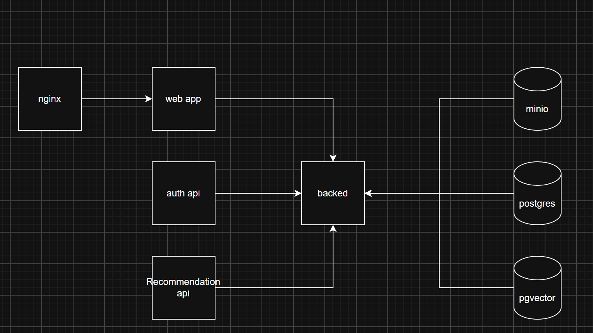

# Dvizh



## Сервисы

- `nginx` — публичная входная точка на `http://localhost:8080`;
- `web-app` — FastAPI-прокси, который отдаёт HTML/CSS/JS и перенаправляет `/api` в backend;
- `backend` — основной FastAPI API;
- `auth-api` — внутренний FastAPI-сервис аутентификации;
- `recommendation-service` — отдельный FastAPI-сервис рекомендаций;
- `postgres` — основная реляционная база;
- `pgvector` — отдельный PostgreSQL с расширением pgvector;
- `minio` — S3-совместимое файловое хранилище, консоль на `http://localhost:9001`.
- `minio-init` — одноразовый контейнер для создания bucket в MinIO.

## Структура

Имя каждого каталога совпадает с именем сервиса в `compose.yaml`, а его
`Dockerfile` находится в корне каталога:

```text
auth-api/
backend/
minio/
minio-init/
nginx/
pgvector/
postgres/
recommendation-service/
web-app/
```

Python-сервисы `auth-api`, `backend`, `recommendation-service` и `web-app` имеют
одинаковый production-oriented layout:

```text
service/
├── src/
│   └── package/
│       ├── __init__.py
│       ├── config.py
│       └── main.py
├── tests/
├── .dockerignore
├── Dockerfile
├── pyproject.toml
└── uv.lock
```

Зависимости фиксируются отдельным `uv.lock` для каждого сервиса. Docker-образы
собираются в два этапа, устанавливают пакет в non-editable режиме и запускаются
от непривилегированного пользователя без uv и исходников в runtime-слое.

Запрос проходит по цепочке `Nginx → web-app → backend`. Recommendation-service,
backend и хранилища доступны только внутри сети Compose.

## Запуск

1. Скопируйте `.env.example` в `.env` и замените пароли.
2. Запустите проект:

   ```shell
   docker compose up --build
   ```

3. Откройте `http://localhost:8080`.

Проверка API:

```shell
curl http://localhost:8080/api/health
```

Swagger основного backend: `http://localhost:8080/api/docs`.

## Локальная разработка Python-сервисов

Команды выполняются из каталога нужного сервиса, например `backend`:

```shell
uv sync --locked
uv run ruff check .
uv run pytest
```

Запуск backend локально (Swagger: `http://localhost:8000/api/docs`):

```shell
uv run uvicorn dvizh_backend.main:app --reload --port 8000
```

Без PostgreSQL backend всё равно стартует и показывает Swagger, но запросы к данным
вернут 500. Таблицы создаются миграциями Alembic (`uv run alembic upgrade head`),
в Docker они применяются при старте контейнера.

Добавление зависимости и обновление lock-файла:

```shell
uv add package-name
```

Остановка контейнеров:

```shell
docker compose down
```

Чтобы дополнительно удалить локальные данные PostgreSQL, pgvector и MinIO:

```shell
docker compose down --volumes
```
