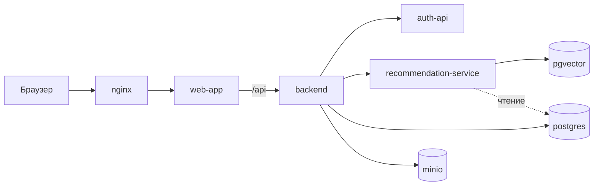

Отдельный PostgreSQL с расширением [pgvector](https://github.com/pgvector/pgvector). Хранит эмбеддинги событий, пользователей и тем и позволяет быстро находить события, близкие по смыслу к интересам пользователя. На этом строится персональная выдача афиши.
 
## Содержание
 
1. [Назначение и границы](#назначение-и-границы)
2. [Место в архитектуре](#место-в-архитектуре)
3. [Структура каталога](#структура-каталога)
4. [Быстрый старт](#быстрый-старт)
5. [Конфигурация](#конфигурация)
6. [Модель данных](#модель-данных)
7. [Индексы](#индексы)
8. [Эмбеддинги](#эмбеддинги)
9. [Контракт запросов](#контракт-запросов)
10. [BPMN](#BPMN:Индексация-событий)
## Назначение и границы
 
В «Движже» событием может быть что угодно: от концерта на тысячи человек до «кто хочет вместе помыть пол». Жёсткие категории такое не покрывают. Эмбеддинг превращает текст события в набор чисел (вектор), и близкие по смыслу события получают близкие векторы. Это позволяет искать похожие события и строить профиль интересов пользователя без ручной классификации.
 
Основные принципы:
 
- Основная БД `postgres` остаётся источником истины. В `pgvector` лежат только производные данные, которые можно пересчитать.
- Связи с `postgres` идут по идентификаторам (`event_id`, `user_id`). Внешних ключей между базами нет.
- Писать в `pgvector` может только `recommendation-service`.
- Приватные, отменённые и удалённые события в поисковый индекс не попадают.
Что входит в этот компонент и что нет:
 
| Входит | Не входит |
|---|---|
| Образ, запуск и настройка БД | Расчёт эмбеддингов (делает `recommendation-service`) |
| Схема таблиц и индексы | Итоговое ранжирование ленты (`recommendation-service`) |
| Описание допустимых запросов | Карточки событий и тексты (хранятся в `postgres`) |
 
## Место в архитектуре
 

 
`pgvector` общается только с `recommendation-service`. Backend к нему напрямую не обращается: он запрашивает рекомендации у `recommendation-service`, а тот ходит в `pgvector` и читает данные событий из `postgres`. Порт `pgvector` наружу не публикуется, база доступна только внутри сети docker compose.
 
## Структура каталога
 
```
pgvector/
├── Dockerfile      # образ на базе pgvector/pgvector
├── .dockerignore
├── init.sql        # создание расширения, таблиц и индексов
└── README.md
```
 
Скрипты инициализации выполняются только при первом запуске с пустым volume. Если схему нужно изменить на уже созданной базе, `init.sql` правкой не поможет: нужен отдельный SQL-скрипт миграции или пересоздание volume.
 
## Быстрый старт
 
```bash
cp .env.example .env
docker compose up -d --build pgvector
docker compose ps pgvector
```
 
Статус должен быть `healthy`. Проверить, что расширение и таблицы созданы:
 
```bash
docker compose exec pgvector psql -U "$PGVECTOR_USER" -d "$PGVECTOR_DB" -c "\dx"
docker compose exec pgvector psql -U "$PGVECTOR_USER" -d "$PGVECTOR_DB" -c "\dt"
```
 
Полный сброс базы (данные можно пересчитать из `postgres`): остановить контейнер, удалить volume `pgvector` и запустить заново.
 
## Конфигурация
 
| Переменная | Назначение |
|---|---|
| `PGVECTOR_DB` | имя базы |
| `PGVECTOR_USER` | пользователь |
| `PGVECTOR_PASSWORD` | пароль (только в `.env`, в git не попадает) |
 
Параметры PostgreSQL, влияющие на работу с векторами:
 
| Параметр | Зачем |
|---|---|
| `shared_buffers` | кэш данных и индекса в памяти |
| `maintenance_work_mem` | скорость построения индекса |
| `hnsw.ef_search` | баланс между скоростью и полнотой поиска (задаётся в запросе) |
 
## Модель данных
 
Размерность вектора: **384**. Она зависит от выбранной модели эмбеддингов (см. раздел [Эмбеддинги](#эмбеддинги)); при смене модели схема меняется.
 
| Таблица | Ключ | Назначение |
|---|---|---|
| `event_embeddings` | `event_id` | вектор события и поля для фильтрации |
| `user_embeddings` | `user_id` | профиль интересов пользователя |
| `topic_embeddings` | `topic_id` | вектор темы, нужен для новых пользователей без истории |
| `occurrence_index` | `occurrence_id` | сеансы событий для фильтров по времени (по желанию, см. ниже) |
 
### `event_embeddings`
 
Одна строка на событие, а не на каждый сеанс. Иначе повторяющееся событие займёт всю ленту копиями.
 
| Поля | Откуда берутся в `postgres` | Зачем |
|---|---|---|
| `event_id` | `events.id` | связь с основной БД |
| `embedding` | считается из текста события | поиск по смыслу |
| `model_version`, `content_hash` | служебные | пересчитывать вектор только при изменении текста или модели |
| `source_updated_at` | `events.updated_at` | не принять устаревшее обновление поверх свежего |
| `status`, `visibility`, `join_policy` | `events` | фильтры доступа |
| `format` | `events.format` | онлайн и офлайн события |
| `country_code`, `city`, `lat`, `lon` | `locations` через `events.location_id` | география |
| `next_starts_at`, `last_ends_at` | `event_occurrences` | быстрый фильтр по времени |
| `price_type`, `price_min`, `price_max`, `currency` | `events` | фильтр по цене |
| `capacity` | `events.capacity` | размер события |
| `topic_ids` | `event_topics` и родительские темы из `topics.parent_id` | фильтр по темам, включая вложенные |
| `organizer_user_id`, `organizer_org_id`, `org_verified` | `events`, `organizations.is_verified` | разнообразие выдачи и доверие к организатору |
| `published_at` | `events.published_at` | свежесть |
 
### `user_embeddings`
 
`user_id`, `embedding`, `model_version`, `interactions` (на скольких действиях построен профиль), `last_interaction_id` (последнее учтённое действие из `event_interactions`), `updated_at`.
 
Если действий мало, вектор пользователя ненадёжен, и для него используется выдача по интересам или популярное.
 
### `topic_embeddings`
 
`topic_id`, `embedding`, `model_version`, `content_hash`. Вектор строится из названия темы с родителями («Спорт > Теннис») и описания.
 
### `occurrence_index` (по желанию)
 
Копия расписания из `event_occurrences`: `occurrence_id`, `event_id`, `starts_at`, `ends_at`, `is_all_day`, `status`. Нужна, чтобы корректно отвечать на запросы вроде «в эти выходные» для повторяющихся событий. Для первой версии можно обойтись полем `next_starts_at` в `event_embeddings`.
 
### Что в `pgvector` не хранится
 
- названия, описания и другие тексты карточек (они в `postgres`);
- персональные данные пользователей и история их действий;
- быстро меняющиеся счётчики (сколько идёт, сколько сохранили);
- приватные события в поисковом индексе.
## Индексы
 
| Индекс | Тип | Для чего |
|---|---|---|
| `event_embedding_hnsw` | HNSW по `embedding`, косинусное расстояние | поиск ближайших событий. Строится только по активным публичным событиям |
| `event_topics_gin` | GIN по `topic_ids` | фильтр по темам |
| `event_city_idx` | B-tree по `city` | фильтр по городу |
| `event_next_idx` | B-tree по `next_starts_at` | фильтр по времени |
 
Что такое HNSW: это индекс для приближённого поиска ближайших векторов. Он работает намного быстрее полного перебора, но может изредка пропустить подходящий результат. При небольшом числе событий (до нескольких тысяч) индекс не обязателен: точный перебор достаточно быстр.
 
Условия частичного индекса (`status = ...`, `visibility = ...`) должны использовать реальные значения из enum в основной БД. Значения нужно уточнить.
 
## Эмбеддинги
 
| Параметр | Значение |
|---|---|
| Модель | `intfloat/multilingual-e5-small` (предложение, подтвердить) |
| Размерность | 384 |
| Метрика | косинусное расстояние, векторы нормализованы |
| Кто считает | `recommendation-service`, модель работает внутри него |
| `model_version` | название модели и версия шаблона текста, например `e5-small@tmpl1` |
 
Текст, из которого строится вектор события:
 
```
passage: {title}. {summary}. {description, первые ~800 символов}
Темы: {названия тем}. Формат: {format}. Место: {название, город}.
```
 
Правила:
 
- В текст не включаются даты, цена, вместимость и организатор. Они хранятся в полях таблицы и используются как фильтры.
- Для поисковых запросов пользователя текст начинается с `query:`, для событий и тем с `passage:` (особенность моделей семейства E5).
- Если меняется модель или шаблон, меняется `model_version`, и все векторы пересчитываются. Векторы разных версий не смешиваются в одном поиске.
> Нужно согласовать с тем, кто делает `recommendation-service`: подходит ли такая модель и работает ли она внутри сервиса или будет вынесена в отдельный контейнер.
 
## Контракт запросов
 
Ниже запросы, которые должна поддерживать база. Значения `$1`, `$2` и так далее подставляет `recommendation-service`. Значения enum (`'published'`, `'public'`) нужно заменить на реальные.
 
**Кандидаты для пользователя** (`$1` это вектор пользователя):
 
```sql
SET hnsw.ef_search = 100;
 
SELECT event_id, 1 - (embedding <=> $1) AS similarity
FROM event_embeddings
WHERE status = 'published'
  AND visibility = 'public'
  AND model_version = $4
  AND (city = $2 OR format <> 'offline')
  AND next_starts_at BETWEEN $3 AND now() + interval '60 days'
ORDER BY embedding <=> $1
LIMIT 200;
```
 
Из этих кандидатов `recommendation-service` выбирает итоговую ленту (учитывает время, расстояние, популярность, друзей).
 
**Похожие события:** тот же запрос, где `$1` это вектор самого события:
 
```sql
SELECT embedding FROM event_embeddings WHERE event_id = $1;
```
 
Сам `event_id` исключается из результата.
 
**Добавление или обновление события** (повторный вызов безопасен, устаревшее обновление не затирает свежее):
 
```sql
INSERT INTO event_embeddings (event_id, embedding, model_version, content_hash,
                              source_updated_at /* , остальные поля */)
VALUES ($1, $2, $3, $4, $5 /* , ... */)
ON CONFLICT (event_id) DO UPDATE SET
    embedding         = EXCLUDED.embedding,
    model_version     = EXCLUDED.model_version,
    content_hash      = EXCLUDED.content_hash,
    source_updated_at = EXCLUDED.source_updated_at
    /* , остальные поля */
WHERE event_embeddings.source_updated_at <= EXCLUDED.source_updated_at;
```
 
**Удаление** отменённого, приватного или удалённого события:
 
```sql
DELETE FROM event_embeddings WHERE event_id = $1;
```
 
Гарантии базы:
 
- фильтры доступа (`status`, `visibility`) применяются в каждом запросе кандидатов;
- запись можно повторять без побочных эффектов;
- поиск возвращает только векторы запрошенной версии модели.

## BPMN:Индексация-событий

 


Как проходит выдача:

Пользователь открывает ленту. Backend запрашивает рекомендации у recommendation-service, передавая пользователя и контекст (город, даты, фильтры).

Сервис просит у pgvector профиль пользователя (вектор интересов и число учтённых действий).
Проверка «достаточно действий?»

Если действий мало, профиль ненадёжен. Тогда работает холодный старт: события по выбранным интересам, популярное и свежее в городе. К pgvector обращения за кандидатами нет.

Если действий достаточно, pgvector ищет ближайшие к профилю события с фильтрами (публичные, активные, нужный город, подходящее время) и возвращает около 200 кандидатов.

Сервис ранжирует кандидатов. Вектор даёт только близость по смыслу. Итоговый порядок учитывает ещё время, расстояние, популярность и то, идут ли друзья. Результат: упорядоченный список event_id.

Backend берёт карточки из postgres по этим event_id (в pgvector названий и описаний нет) и отдаёт ленту пользователю.
